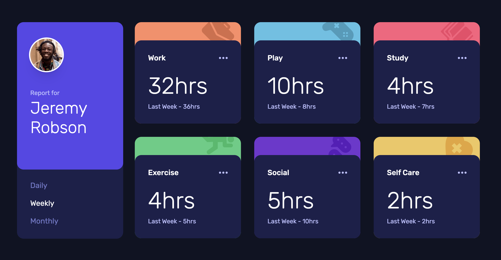

# Frontend Mentor - Time tracking dashboard solution

This is a solution to the [Time tracking dashboard challenge on Frontend Mentor](https://www.frontendmentor.io/challenges/time-tracking-dashboard-UIQ7167Jw).

## Table of contents

- [Overview](#overview)
  - [The challenge](#the-challenge)
  - [Screenshot](#screenshot)
  - [Links](#links)
- [My process](#my-process)
  - [Built with](#built-with)
  - [What I learned](#what-i-learned)
- [Author](#author)

## Overview

### The challenge

Users should be able to:

- View the optimal layout for the site depending on their device's screen size
- See hover states for all interactive elements on the page
- Switch between viewing Daily, Weekly, and Monthly stats

### Screenshot

### Links

- Solution URL: [GitHub repository](https://github.com/samulikn/time-tracking-dashboard)
- Live Site URL: [Live site](https://samulikn.github.io/time-tracking-dashboard)

## My process

### Built with

- Semantic HTML5 markup
- Tailwind CSS with custom properties
- Flexbox
- CSS Grid
- Mobile-first workflow
- Vanilla Javascript

### What I learned

In this project, I practiced CSS Grid to build responsive and clean webpage layouts. I learned how to set up grid containers, adjust columns, and create flexible page structures using modern CSS techniques.

## Author

- Website - [My portfolio](https://natashobotova.onrender.com)
- Frontend Mentor - [@samulikn](https://www.frontendmentor.io/profile/samulikn)
